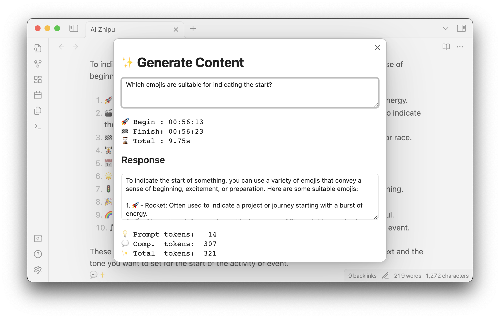

<h4 align="center">
	

		<b>English</b> |
		<a href="README_zh.md">中文</a>
	

</h4>

# Introduction

AI-zhipu is an Obsidian plugin that helps you utilize the Zhipu API to generate content, create images from text, answer questions based on knowledge databases, and more AI capabilities. You can customize prompt template to build your own exclusive knowledge management system based on Zhipu AI.

## New Features

- Support for multi-round conversation. The start of a multi-round conversation is marked by two consecutive lines of horizontal lines, such as two lines of "---", and the end is marked by a single line of horizontal line.

## How to use

- When the plugin is initialized, it will automatically create a folder `Aizhipu` in the vault directory, and create prompt template files, with both Chinese and English templates.
- Register an account on the [ZhiPu website](https://open.bigmodel.cn), obtain the API key, and enter it into the plugin settings.
- Enter edit mode
- Select the prompt, and activate the command "Generate from the selected text / line / block" ， then select the prompt template.

- Select the text of the block for easy copying to other places

- View the details of the last chat in the chat details, including the prompt and token usage.

## Requirements

- An API key from [ZhiPu AI](https://open.bigmodel.cn)
- Network connection when using the command "Generate from the selected text / line / block"
- Using the ZhiPu API will incur charges. For detailed fee information, please refer to the [official ZhiPu website](https://open.bigmodel.cn). It is important to note that generating images from text consumes a significant number of tokens.

## Install from the marketplace

1. Open the Obsidian community plugin marketplace
2. Search for "AI Zhipu"

## Install from Github

1. From the release page, download `manifest.json` and `main.js` to `<vault>/.obsidian/plugins/ai-zhipu`
2. Refresh installed plugins
3. Enable AI Zhipu
