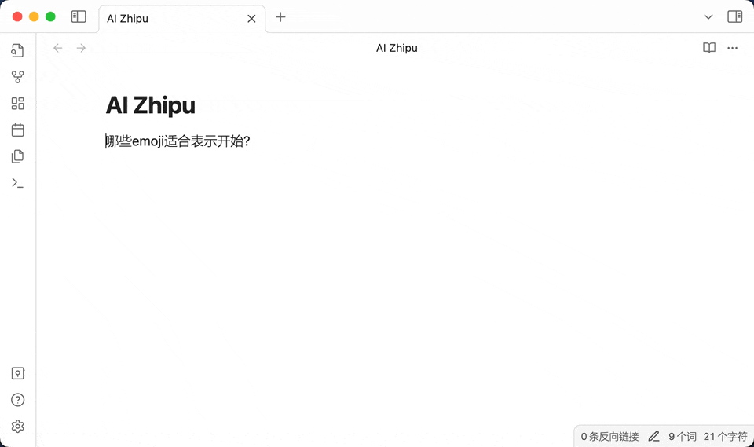
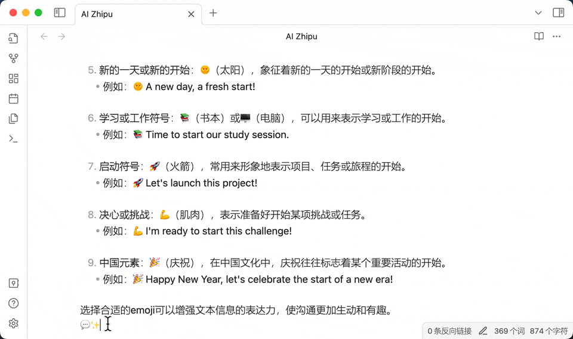
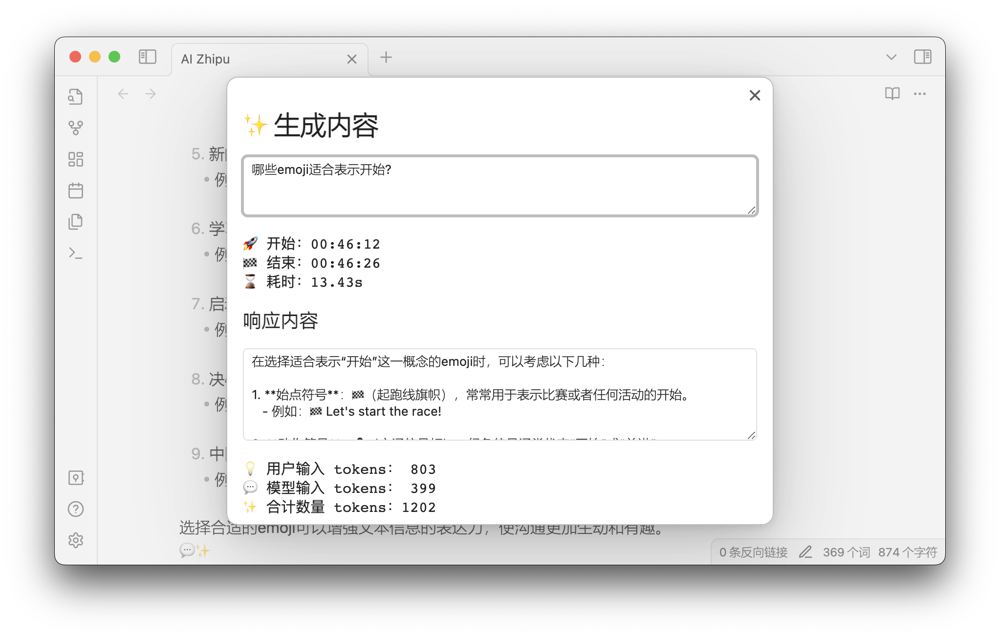

<h4 align="center">
	

		<a href="README.md">English</a> |
			<b>中文</b>
	

</h4>

# 简介

Ai-zhipu 是一个 obsidian 的插件，帮助你使用智谱 API，生成内容、文生图、基于知识库问答等等 AI 能力，你可以定制提示词模板，基于智谱 AI 来打造你的专属知识管理系统。

## 新特性

- 支持多轮会话，多轮会话的开始标记是连续两行的水平线，例如两行的“---”，结束标记是一行水平线

## 如何使用

- 插件初始化时，会自动在 vault 的目录下创建一个文件夹 `Aizhipu`，创建提示词模板文件，有中英文两种模板。
- 在[智谱网站](https://open.bigmodel.cn)注册账号，获取 API key，填入插件设置中
- 进入编辑模式
- 选中提示词，启动命令“生成内容（基于选中的文本、行、区块）”，选择提示词模板

- 选取区块的文本，方便复制到其他地方

- 在对话详情中查看上次对话的详情，详情包括提示词、tokens 使用情况

## 要求

- [智谱 AI](https://open.bigmodel.cn) 的 API key
- 使用命令“生成内容（基于选中的文本、行、区块）”时需要网络连接
- 智谱 API 调用会产生费用，具体费用请参考[智谱官网](https://open.bigmodel.cn)。需要注意的是，文生图的 tokens 消耗较大。

## 从市场安装

1. 打开 Obsidian 的社区插件市场
2. 搜索“AI Zhipu”

## 从 Github 安装

1. 从 release 页面下载 `manifest.json` 和 `main.js` 到 `<vault>/.obsidian/plugins/ai-zhipu`
2. 刷新已安装的插件
3. 启用 AI Zhipu
