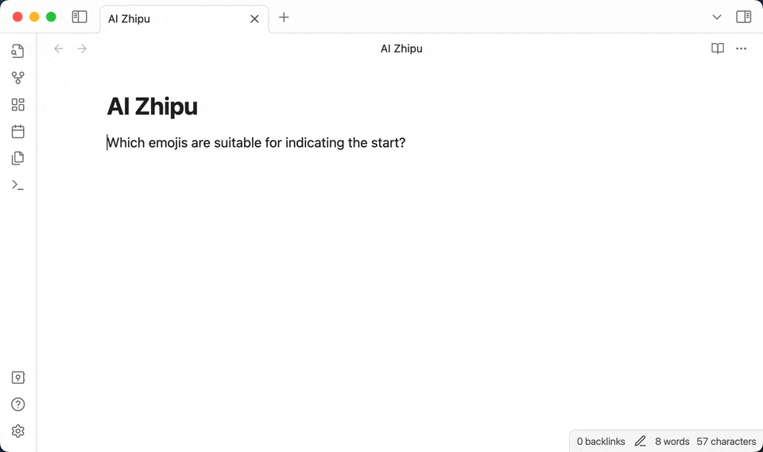
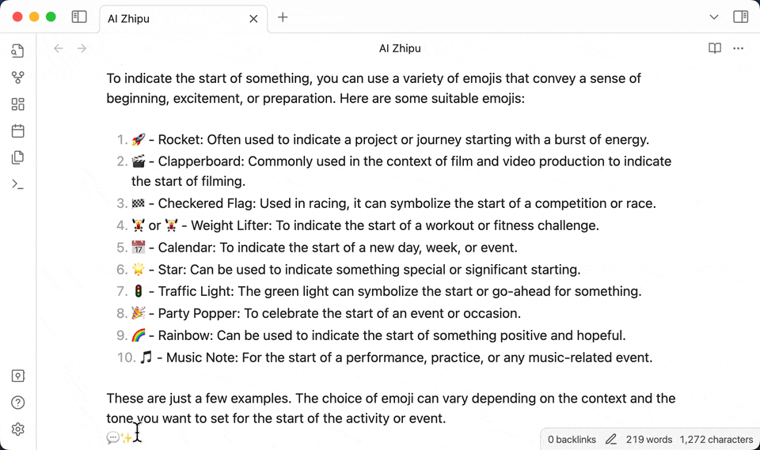

<h4 align="center">
	

		<b>English</b> |
		<a href="README_zh.md">中文</a>
	

</h4>

# Introduction

AI-zhipu is an Obsidian plugin that helps you utilize the Zhipu API to generate content, create images from text, answer questions based on knowledge databases, and more AI capabilities. You can customize prompt template to build your own exclusive knowledge management system based on Zhipu AI.

## How to use

- Register an account on the [ZhiPu website](https://open.bigmodel.cn), obtain the API key, and enter it into the plugin settings.
- Enter edit mode
- Select the prompt, and activate the command "Generate from the selected text / line / block" ， then select the prompt template.

- Select the text of the block for easy copying to other places

- View the details of the last chat in the chat details, including the prompt and token usage.

## Install from Github

1. From the release page, download `manifest.json` and `main.js` to `<vault>/.obsidian/plugins/ai-zhipu`
2. Refresh installed plugins
3. Enable AI Zhipu
